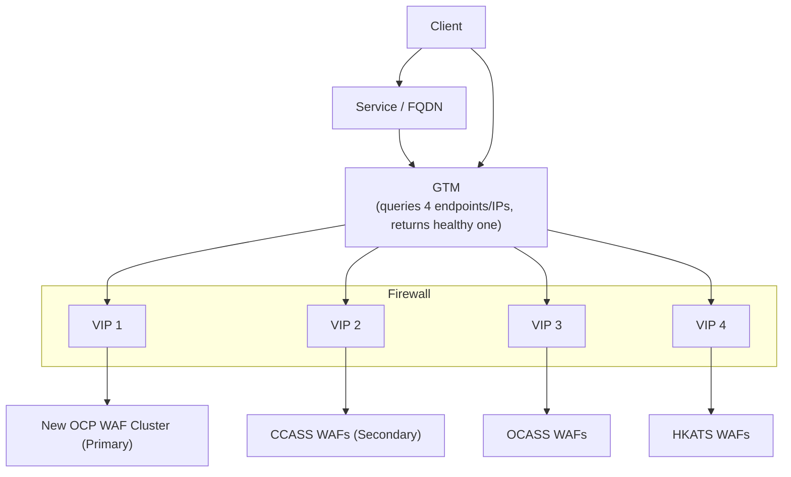

```mermaid
graph TD
    Client["Client"]
    ServiceFQDN["Service / FQDN"]
    GTM["GTM\n(queries 4 endpoints/IPs, returns healthy one)"]

    subgraph Firewall
        direction TB
        VIP1["VIP 1"]
        VIP2["VIP 2"]
        VIP3["VIP 3"]
        VIP4["VIP 4"]
    end

    WAF1["New OCP WAF Cluster (Primary)"]
    WAF2["CCASS WAFs (Secondary)"]
    WAF3["OCASS WAFs"]
    WAF4["HKATS WAFs"]

    Client --> ServiceFQDN
    ServiceFQDN --> GTM
    Client --> GTM
    GTM --> VIP1
    GTM --> VIP2
    GTM --> VIP3
    GTM --> VIP4

    VIP1 --> WAF1
    VIP2 --> WAF2
    VIP3 --> WAF3
    VIP4 --> WAF4

```
