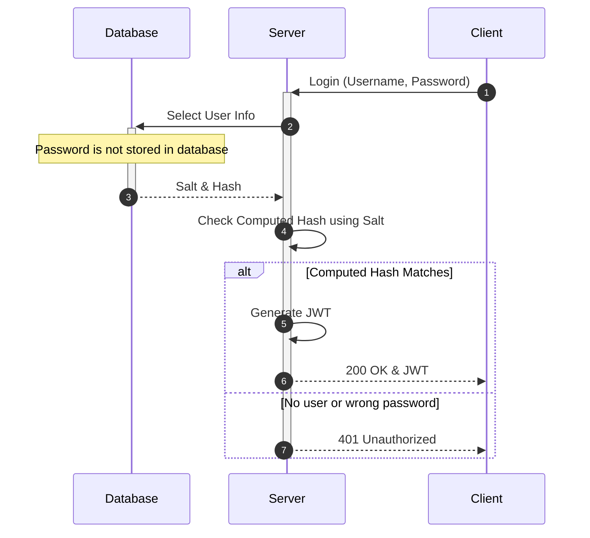

```mermaid

sequenceDiagram

    autonumber
    participant DB as Database
    participant S as Server
    participant C as Client

    C->>+S: Login (Username, Password)
    S->>+DB: Select User Info
    note over DB: Password is not stored in database
    DB-->>-S: Salt & Hash
    S->>S: Check Computed Hash using Salt
    alt Computed Hash Matches
        S->>S: Generate JWT
        S-->>C: 200 OK & JWT
    else No user or wrong password
        S-->>C: 401 Unauthorized
    end
    deactivate S


```
